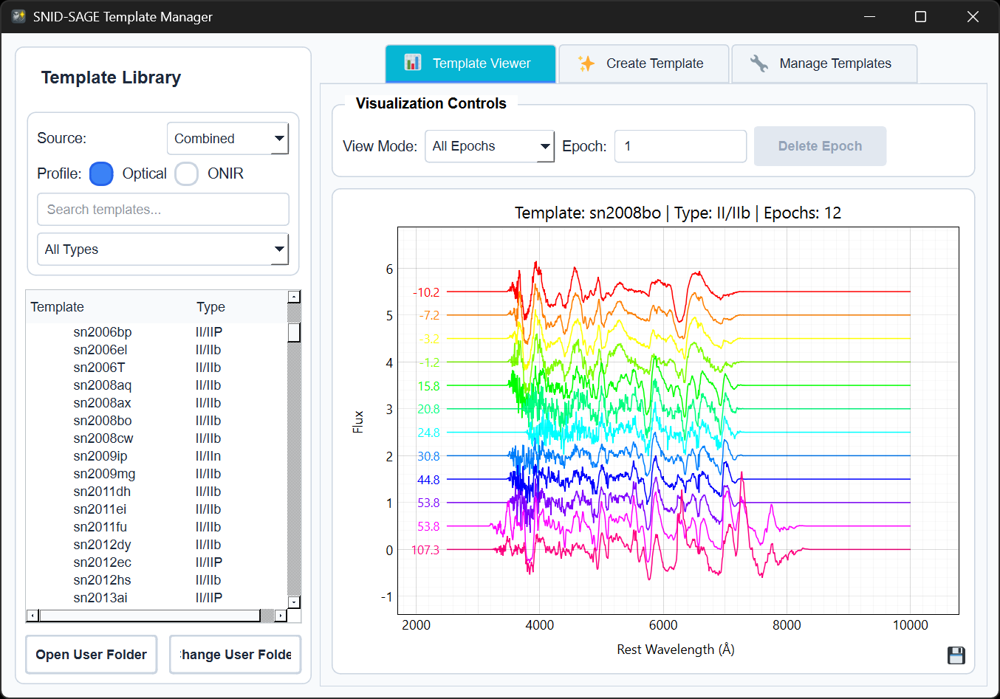
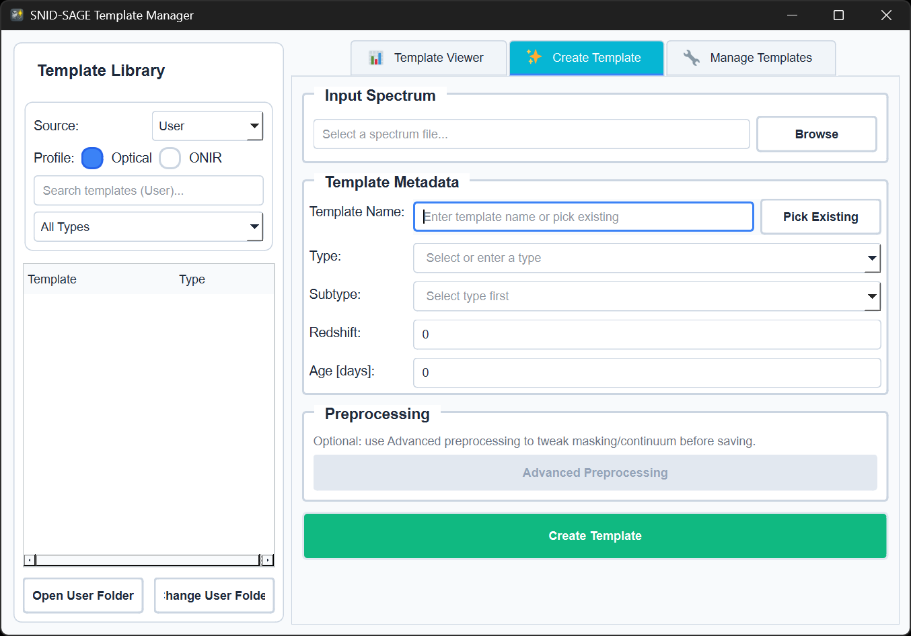

# Template Library

SNID SAGE includes a curated library of 698 supernova and transient spectra for classification.

## Built-in Templates

Templates are auto-downloaded on first use (~50 MB). No manual setup required.

| Type | Count | Subtypes |
|------|------:|----------|
| Ia | 268 | norm, 91T, 91bg, Ia-csm, Ia-pec |
| II | 108 | IIP, IIL, IIn, IIb |
| Ic | 68 | Ic, Ic-BL |
| Ib | 54 | Ib, Ib-pec, Ib-Ca-rich |
| SLSN | 53 | SLSN-I, SLSN-II |
| Galaxy | 27 | Various galaxy types |
| TDE | 16 | Tidal disruption events |
| AGN | 12 | AGN-type1, QSO |
| GAP | 10 | Gap transients, LRN |
| Ibn | 10 | Type Ibn |
| CV | 9 | Cataclysmic variables |
| Star | 3 | Stellar spectra |
| LFBOT | 3 | Fast blue optical transients |
| Icn | 1 | Type Icn |
| KN | 1 | Kilonova |

## Storage Format

Templates are stored in HDF5 files grouped by type:

```
templates/
├── template_index.json      # Metadata index
├── templates_Ia.hdf5        # Type Ia templates
├── templates_II.hdf5        # Type II templates
├── templates_Ib.hdf5        # ... and so on
└── ...
```

### Index Structure

`template_index.json` contains metadata for all templates:

**Version note**: `"version"` is the **index/HDF5 format version** (schema). The **template bank version** (downloaded contents) is tracked separately by the templates downloader.

```json
{
  "version": "2.0",
  "template_count": 698,
  "grid_params": {
    "NW": 1024,
    "W0": 2500.0,
    "W1": 10000.0
  },
  "templates": {
    "sn1994D": {
      "type": "Ia",
      "subtype": "norm",
      "redshift": 0.0,
      "epochs": 17,
      "storage_file": "templates_Ia.hdf5"
    }
  }
}
```

### HDF5 Structure

Each HDF5 file contains pre-rebinned spectra and FFTs:

**Version note**: `metadata/version` is the **HDF5 format version** (schema), not the template bank contents version.

```
templates_Ia.hdf5
├── metadata/
│   ├── version: "2.0"
│   ├── grid_rebinned: true
│   └── wavelength: [2500...10000]  # 1024 points
└── templates/
    └── sn1994D/
        ├── flux: [...]           # Rebinned spectrum
        ├── fft_real: [...]       # Pre-computed FFT
        ├── fft_imag: [...]
        ├── type: "Ia"
        ├── subtype: "norm"
        ├── age: 0.0
        ├── epochs: 17
        └── epoch_data/           # Multi-epoch data
            ├── epoch_-10/
            ├── epoch_0/
            └── ...
```

## Template Manager GUI

Open the standalone Template Manager with `snid-sage-templates`.



The Template Manager lets you:
- **Browse** all templates with search and type filters
- **Preview** spectra with metadata
- **View** multi-epoch template evolution
- **Create** new templates from your spectra



### Creating Templates

1. Open `snid-sage-templates` → **Create Template** tab
2. Load your spectrum file
3. Fill in metadata (name, type, subtype, age, redshift)
4. Preview and save

## User Templates

Custom templates are stored separately from the built-in bank.

### Location

- **User folder**: Set on first use and changed later from `snid-sage-templates` via `Change User Folder`
- **User index**: `template_index.user.json`
- **User HDF5**: `templates_Ia.user.hdf5`, etc.

### Override Behavior

When a user HDF5 exists for a type (e.g., `templates_Ia.user.hdf5`), it **replaces** the built-in templates for that type. This prevents duplicates and ensures your edits take effect.

## ONIR Templates

For near-infrared analysis, use `--profile onir`. ONIR templates cover 2000–25000 Å and are stored in separate files (`templates_Ia_onir.hdf5`, etc.).

## Template Helpers

```powershell
# Open the standalone Template Manager GUI
snid-sage-templates

# Download or refresh the managed built-in template bank
snid-sage-download-templates

# Force a re-download of the managed bank
snid-sage-download-templates --force
```

## See Also

- [Custom Templates](custom-templates.md) - Creating your own templates
- [Templates Manager (GUI)](../gui/templates-manager.md) - Detailed GUI guide
- [CLI Reference](../cli/command-reference.md) - CLI analysis and template-bank helpers
